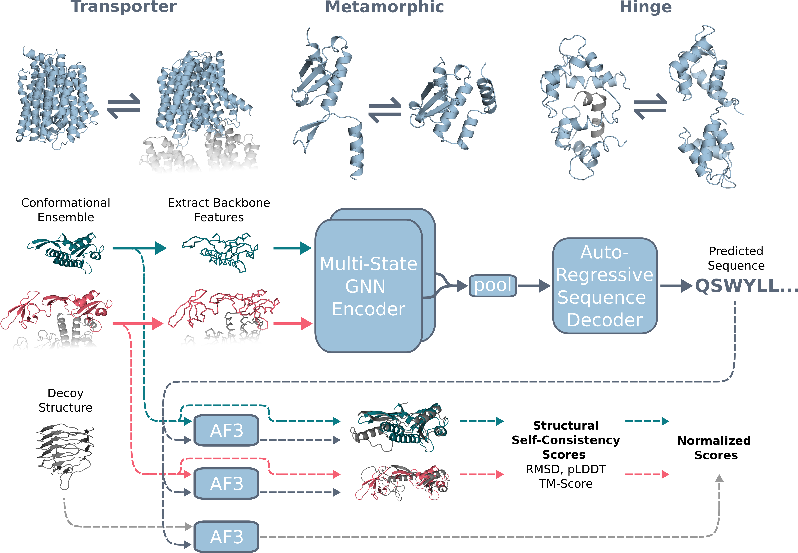

# DynamicMPNN

DynamicMPNN is a deep learning inverse folding model that generates protein sequences compatible with multiple conformational states. Built on GVP-GNN architecture, it pools structural information across conformations during encoding and uses autoregressive decoding to predict amino acid sequences. We introduce a multi-state self-consistency metric using template-based AlphaFold3 structure prediction with decoy normalization to evaluate design success.



## Installation

```bash
conda env create -f environment.yml
conda activate dynamicmpnn
pip install -e .
```

## Configuration

Create a `.env` file from the template and update paths for your machine:

```bash
cp .env.example .env
```

Required paths:
- `PROJECT_PATH` - Path to this repository
- `PUBLIC_DB` - Directory containing processed `.pt` files (e.g., `data/`)
- `RUNS_PATH` - Where training runs/checkpoints are saved

Optional (for AF3 evaluation):
- `AF3_EXECUTABLE`, `AF3_SCRIPT`, `AF3_MODEL_DIR`, `AF3_DB_DIR`

## Data

Download processed `.pt` files from [Zenodo](https://zenodo.org/records/19687631) and extract to `data/`:

```bash
# Multi-chain
data/train_pt_multi_chain/
data/val_pt_multi_chain/
data/test_pt_multi_chain/

# Single-chain
data/train_pt_single_chain/
data/val_pt_single_chain/
data/test_pt_single_chain/
```

Update `PUBLIC_DB` in `.env` to point to `data/`.

## Checkpoints

Pre-trained model checkpoints are available in the `checkpoints/` directory. Each checkpoint contains model weights, hyperparameters, and optimizer state.

| Checkpoint | Description |
|------------|-------------|
| `multi_chain_reload.ckpt` | Multi-chain mode, 2-state with full PDB encoding, per-epoch cluster resampling |
| `multi_chain_no_reload.ckpt` | Multi-chain mode, 2-state with full PDB encoding, static cluster sampling |
| `single_chain_k*.ckpt` | Single-chain mode, supports up to 5 conformational states (k=2,3,5 available) |

## Training

### Setup

1. Download processed `.pt` files from [Zenodo](https://zenodo.org/records/19687631) to `data/`
2. Configure paths in `.env`

### Experiments

| Experiment | Description |
|------------|-------------|
| `seq30_reload` | Multi-chain, per-epoch cluster resampling |
| `seq30_no_reload` | Multi-chain, static cluster sampling |
| `single_chain_k_conf` | Single-chain, k conformations pooling |

### Commands

```bash
cd src/dynamicmpnn

# Full training
python train.py experiment=seq30_reload

# Quick test run
python train.py experiment=seq30_reload trainer.max_epochs=1 trainer.limit_train_batches=10

# Resume from checkpoint
python train.py experiment=seq30_reload ckpt_path=path/to/checkpoint.ckpt
```

## Evaluation

### Sequence Sampling

Generate sequences for a multi-state target:

```bash
dynamicmpnn-evaluate \
  eval=1bdt_1qtg \
  eval.model_ref=checkpoints/multi_chain_reload.ckpt \
  output_dir=runs/1bdt_1qtg
```

Key parameters:
- `eval.num_samples`: Number of sequences to generate (default: 25)
- `eval.temperature`: Sampling temperature

Output: `samples/samples.csv` and `samples/samples.fasta`

See example configs in `src/dynamicmpnn/configs/eval/` for custom targets.

### AF3 Self-Consistency Metrics

Enable AlphaFold3 structure prediction to compute self-consistency metrics:

```bash
dynamicmpnn-evaluate \
  eval=1bdt_1qtg \
  eval.model_ref=checkpoints/multi_chain_reload.ckpt \
  eval.af3_evaluate=true \
  output_dir=runs/1bdt_1qtg
```

Requires AF3 paths configured in `.env`.

Metrics computed:
- **TM-score**: Template modeling score (Kabsch-aligned)
- **LDDT**: Local distance difference test
- **RMSD**: Root mean square deviation
- **pLDDT**: Predicted local distance difference test

Decoy normalization is used for fair comparison. Output: `summary_af3_results.csv`

## Data Preprocessing (optional)

To regenerate `.pt` files from scratch, start from the AlphaFold mmCIF database. See `src/dynamicmpnn/scripts/README.md` for full details.

```bash
cd src/dynamicmpnn/scripts

# 1-2. Cluster sequences (mmseqs2 at 30/80% identity)
sbatch clustering/sbatch_cluster.sh

# 3. Gather sequences per cluster + ClustalOmega alignment
sbatch pipeline/slurm_gather_seq80

# 4. Process to .pt files
sbatch pipeline/slurm_process_pt_seq80

# 5. Run foldseek for TM-scores
sbatch your_slurm_foldseek.sh  # wrapper for foldseek/tm_foldseek.py

# 6. Enrich .pt with TM-scores
sbatch pipeline/slurm_add_TM_scores_seq80

# 7-8. Build train/val/test splits
python clustering/build_train_val_test_split.py
python splits/build_val_test_pts.py
```

## Citation

```bibtex
@inproceedings{abrudan_dynamicmpnn,
  title={Multi-state Protein Sequence Design with DynamicMPNN},
  author={Abrudan, Alex and Ojeda, Sebastian Pujalte and Joshi, Chaitanya K and Greenig, Matthew and Engelberger, Felipe and Khmelinskaia, Alena and Meiler, Jens and Vendruscolo, Michele and Knowles, Tuomas},
  booktitle={International Conference on Learning Representations (ICLR)},
  year={2026}
}
```
